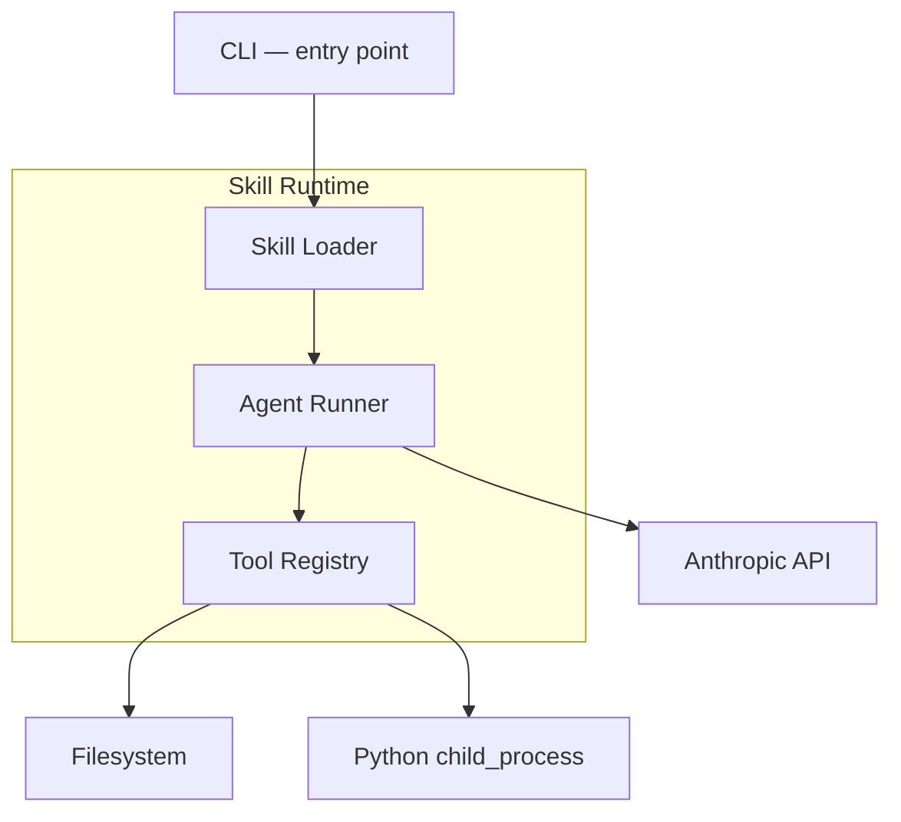
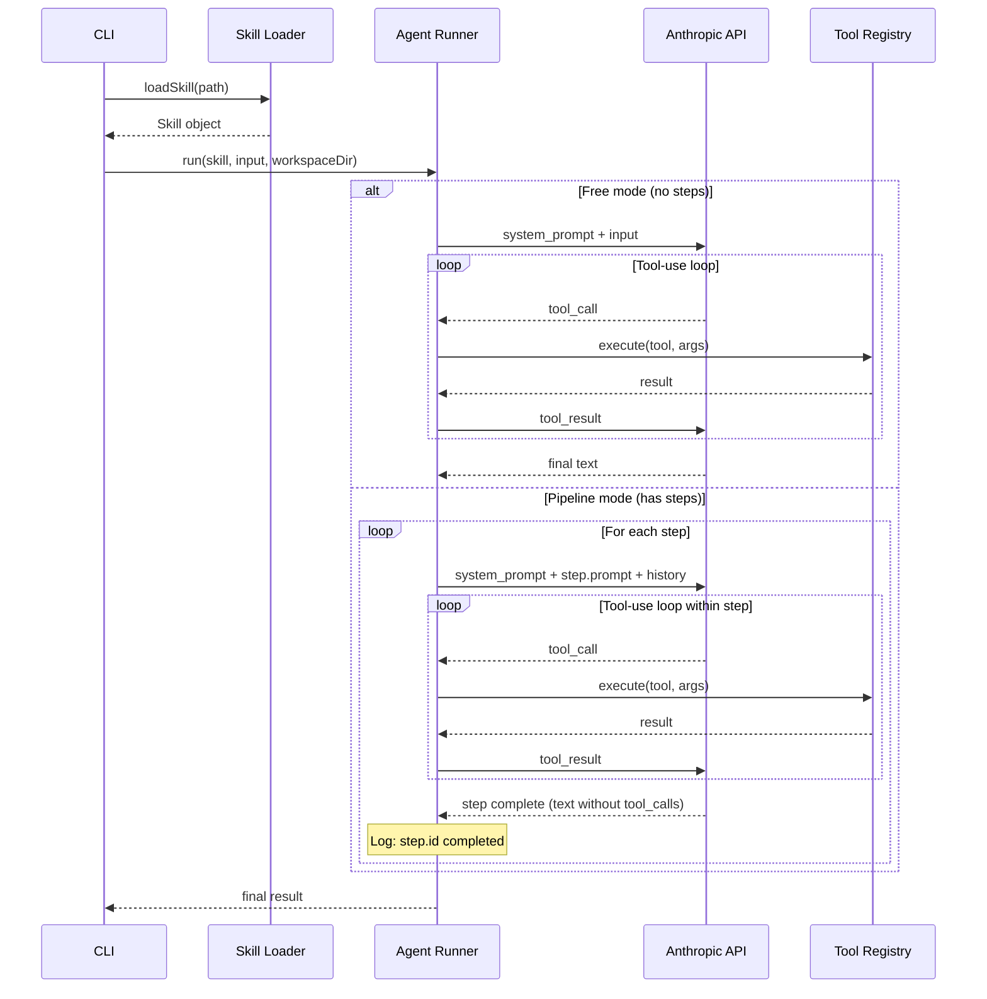

# Design Document — Skill Runtime

## Overview

Skill Runtime — minimal runtime for executing AI skills via Anthropic Claude API. A single YAML skill format where the presence/absence of an optional `steps` field determines the operating mode: free (model acts autonomously) or pipeline (steps execute strictly in order).

Key architectural decision: the skill format is not two types with a switch, but one type with an optional extension. A skill without `steps` is a special case of a skill with `steps` where there are zero steps. The runtime handles both cases uniformly.

Stack: TypeScript, Node.js 20+, @anthropic-ai/sdk, pnpm. Expected volume: 300–500 lines.

## Architecture

### System Diagram



### Execution Flow



### Pipeline Mode Principle

The runtime controls step order programmatically, not through prompt engineering:

1. The model receives only the current step's prompt — it doesn't know about subsequent steps
2. Transition to the next step occurs only when the model returns text without tool_calls
3. The runtime itself injects the next step's prompt as a new user message
4. Previous step history is preserved in context — the model sees results but not future step prompts

This fundamentally differs from "asking the model to follow order" — here order is guaranteed by architecture, not by hoping the LLM obeys.

**Honest limitation:** the model can write Python code within a single step that performs all operations at once (handle missing + remove duplicates + normalize + split). The runtime cannot semantically verify that Python code does only what the current step asks. This is a fundamental limitation of any runtime without formal code verification. We acknowledge this honestly rather than hiding behind "the model doesn't see other prompts".

**Step completion limitation:** a step is considered complete when the model returns text without tool_calls. Theoretically the model could return text like "Got it, starting" without actual execution — and the runtime would consider the step complete. In practice this is solved by step prompt quality (directive formulations: "Execute... Save result to..."), not by complicating the runtime. Adding artifact verification after each step is a path toward domain-specific validation, which is outside the scope of a minimal runtime.

## Components and Interfaces

### Skill Loader

Reads YAML files and validates structure.

```typescript
interface SkillLoader {
  load(filePath: string): Skill;
}
```

Validation:
- Required fields: `name`, `description`, `system_prompt`, `tools`
- If `steps` present: each step must have `id` and `prompt`, ids must be unique
- Each tool in `tools` must be registered in Tool Registry
- YAML syntax must be valid

On error — throws exception with problem description (field name, duplicate id, unknown tool).

### Tool Registry

Fixed tool set with JSON Schema descriptions for Anthropic API.

```typescript
interface ToolRegistry {
  execute(name: string, args: Record<string, unknown>, workspaceDir: string): Promise<string>;
  getToolDefinitions(allowedTools: string[]): ToolDefinition[];
}
```

Tools:

| Tool | Input | Output | Notes |
|---|---|---|---|
| `read_file` | `{ path: string }` | File contents | Path relative to workspaceDir |
| `list_directory` | `{ path: string }` | File/dir list | Path relative to workspaceDir |
| `run_python` | `{ code: string }` | stdout | Timeout 30s, cwd = workspaceDir, Python command via env `PYTHON_CMD` (default: `python` on Windows, `python3` elsewhere) |

All file paths resolve relative to `workspaceDir`. Path traversal protection: paths are normalized and compared case-insensitive (for Windows compatibility). On execution error — returns error text (stderr / exception message), not an exception. The model must see errors and react to them.

### Agent Runner

Main LLM interaction loop. Single entry point for both modes. Shared `handleToolCalls` function processes tool calls in both modes (DRY). Model configurable via env `ANTHROPIC_MODEL` (default: `claude-sonnet-4-20250514`).

```typescript
interface AgentRunner {
  run(skill: Skill, input: Record<string, string>, workspaceDir: string): Promise<string>;
}
```

Mode selection logic:
```typescript
if (skill.steps && skill.steps.length > 0) {
  return runPipeline(skill, input, workspaceDir);
} else {
  return runFree(skill, input, workspaceDir);
}
```

**Free mode (`runFree`):**
1. Forms system message from `system_prompt`
2. Forms first user message from `input`
3. Runs tool-use loop: send → receive → if tool_call — execute and send result → repeat
4. Completes when model returns `stop_reason: "end_turn"` without tool_calls

**Pipeline mode (`runPipeline`):**
1. Forms system message from `system_prompt`
2. For each step:
   a. Adds user message with `step.prompt` (including workspace path)
   b. Runs tool-use loop within step
   c. When model returns text without tool_calls — step complete
   d. Logs `[Step ${step.id}] completed`
3. Returns last step's response

### CLI

Entry point — minimal CLI without frameworks (process.argv).

```typescript
// Usage:
// npx tsx src/cli.ts <skill.yaml> --input file=data.csv [--workspace ./workspace]
```

Parameters:
- First argument: path to skill YAML file
- `--input key=value`: input parameters (multiple allowed)
- `--workspace path`: working directory (default: `./workspace`)

Checks `ANTHROPIC_API_KEY` in env. Outputs tool calls and results to stdout for observation.

## Data Models

### Skill

```typescript
interface Skill {
  name: string;
  description: string;
  system_prompt: string;
  tools: string[];
  steps?: Step[];
  input?: Record<string, string>;
  output?: Record<string, string>;
}
```

### Step

```typescript
interface Step {
  id: string;
  prompt: string;
}
```

### Tool Definition (for Anthropic API)

```typescript
interface ToolDefinition {
  name: string;
  description: string;
  input_schema: {
    type: "object";
    properties: Record<string, unknown>;
    required: string[];
  };
}
```

### YAML Example — csv-explore (free mode)

```yaml
name: csv-explore
description: Explore a CSV file and produce a markdown report
tools: [read_file, list_directory, run_python]
system_prompt: |
  You are a data analyst. You receive a CSV file to explore.
  Investigate the data freely: look at structure, find anomalies,
  analyze distributions, discover patterns.
  Produce a comprehensive markdown report.
input:
  file: "path to CSV file"
output:
  report: "markdown report in workspace"
```

### YAML Example — csv-prepare-for-ml (pipeline mode)

```yaml
name: csv-prepare-for-ml
description: Prepare a CSV file for machine learning
tools: [read_file, run_python]
system_prompt: |
  You are a data engineer. You will receive step-by-step instructions.
  Execute each step precisely. Save intermediate results to the workspace.
steps:
  - id: handle_missing
    prompt: "Handle all missing values in the dataset. Save the cleaned file."
  - id: remove_duplicates
    prompt: "Remove duplicate rows from the dataset. Save the result."
  - id: normalize
    prompt: "Normalize all numeric columns using min-max scaling. Save the result."
  - id: split
    prompt: "Split the dataset into train (80%) and test (20%) sets. Save both files."
input:
  file: "path to CSV file"
output:
  train: "train.csv in workspace"
  test: "test.csv in workspace"
```

## Trade-offs

### Rejected Alternative 1: JSON instead of YAML as skill format

Idea: describe skills in JSON files. JSON is the de-facto standard for Node.js configs, parses natively without dependencies, and supports JSON Schema validation at runtime.

```json
{
  "name": "csv-prepare-for-ml",
  "system_prompt": "You are a data engineer...",
  "tools": ["read_file", "run_python"],
  "steps": [
    { "id": "handle_missing", "prompt": "Handle all missing values..." }
  ]
}
```

**Why rejected:**

JSON is poorly suited for storing prompts. `system_prompt` is multiline text, often 10-20 lines. In JSON it must be escaped (`\n`), killing readability and making editing painful. YAML supports block strings (`|`) natively — the prompt looks like regular text. For a skill where the prompt is the central element, this is critical. JSON Schema validation is a nice bonus, but can be implemented over YAML too (parse YAML → get object → validate programmatically). We remove one dependency (`yaml`) but lose format ergonomics. For a minimal runtime with two skills, readability matters more than native parsing.

### Rejected Alternative 2: TypeScript files as skills (programmatic API)

Idea: instead of a declarative format, describe skills as TypeScript modules. Each skill is a `.ts` file exporting an object with the required structure. This gives full typing, IDE autocomplete, and the ability to use logic (conditions, loops) directly in skill definitions.

```typescript
export default defineSkill({
  name: "csv-prepare-for-ml",
  tools: [readFile, runPython],
  steps: [
    { id: "handle_missing", prompt: `Handle missing values...` },
  ],
  systemPrompt: `You are a data engineer...`,
});
```

**Why rejected:**

A programmatic API blurs the boundary between skill definition and execution. A skill should be data, not code — this allows loading, validating, and inspecting skills without execution. A TypeScript file must be imported (and thus executed), creating security issues when loading skills from external sources. The assignment asks for a "declarative format" — YAML/JSON/markdown. A TypeScript module is imperative code, even if it looks declarative. For an AI agent marketplace (vacancy context), a declarative format is critical: skills must be portable, inspectable, and safe to load.

### Rejected Alternative 3: Separate conversation threads for each pipeline step

Idea: each pipeline step runs in an isolated context (new conversation). Data between steps transfers only through workspace (files), not message history. Maximum isolation — the model on step 3 physically cannot see prompts and responses from steps 1-2.

**Why rejected:**

Full isolation sounds like a security advantage but kills practical usefulness. The model on step `normalize` doesn't know what columns were in the original dataset, what values were filled on step `handle_missing`, what format was chosen. It would need to re-discover context through tool calls (read_file), spending tokens and time. Worse — without history the model may make decisions contradicting previous steps (e.g. choose a different normalization strategy). Shared history is not a leak but necessary context for pipeline coherence.

## Correctness Properties

*A property is a characteristic or behaviour that must hold across all valid executions of the system. It is a formal statement of what the system must do. Properties serve as a bridge between human-readable specifications and machine-verifiable correctness guarantees.*

### Property 1: Skill loading round-trip

*For any* valid Skill object, if serialized to YAML and loaded back through Skill Loader, the result must be equivalent to the original object (modulo field types).

**Validates: Requirements 2.1, 2.6, 1.1, 1.5**

### Property 2: Skill error validation

*For any* YAML object missing at least one required field (name, description, system_prompt, tools), or containing an unregistered tool in tools, or containing a step with a duplicate id, Skill Loader must throw an error identifying the specific problem (field name, tool name, or duplicate id).

**Validates: Requirements 2.2, 2.3, 2.4, 1.1, 1.5**

### Property 3: Mode selection by steps presence

*For any* valid Skill, if `steps` field is present and non-empty — the runtime must select pipeline mode; if `steps` is absent or empty — free mode. No other factors should influence mode selection.

**Validates: Requirements 1.2, 1.3, 1.4**

### Property 4: Tool errors returned as strings

*For any* tool call from Tool Registry that fails (non-existent file, invalid Python code, timeout), the result must be a string describing the error, not an exception. The calling code must not receive a throw.

**Validates: Requirements 3.5, 3.7**

### Property 5: Disallowed tools are rejected

*For any* tool_call with a tool name not in the current skill's `tools` list, Agent Runner must return an error message to the model specifying the unavailable tool, without executing the call.

**Validates: Requirements 4.4, 5.5**

### Property 6: Pipeline executes steps strictly in order with isolation

*For any* skill with N steps (N ≥ 1), Agent Runner in pipeline mode must: (a) inject step prompts strictly in the order defined in the `steps` array, (b) send the model only the current step's prompt at each step, not revealing subsequent step prompts, (c) transition to the next step only after the current one completes.

**Validates: Requirements 5.1, 5.2, 5.3, 5.4**

### Property 7: Pipeline preserves history

*For any* skill with N steps, at step K (where K > 0) the conversation context must contain results of all previous steps 0..K-1, including tool_call results.

**Validates: Requirements 5.6, 4.5**

### Property 8: File paths resolve relative to workspace

*For any* relative path passed to read_file, list_directory, or run_python tools, Tool Registry must resolve it relative to workspaceDir. Absolute paths outside workspaceDir must not be processed.

**Validates: Requirements 6.4, 6.2**

## Error Handling

### Skill Loader Level
- **File not found**: error with file path
- **Invalid YAML**: parser error with problem description
- **Missing required field**: error with field name
- **Unknown tool**: error with tool name
- **Duplicate step id**: error with id

All Skill Loader errors are fatal. Skill does not run.

### Tool Registry Level
- **read_file — file not found**: returns `"Error: file not found: {path}"`
- **read_file — path outside workspace**: returns `"Error: path outside workspace"`
- **list_directory — directory not found**: returns `"Error: directory not found: {path}"`
- **run_python — syntax error**: returns Python stderr
- **run_python — runtime error**: returns Python stderr
- **run_python — timeout (30s)**: kills process, returns `"Error: execution timed out after 30 seconds"`

Tool errors are non-fatal. Returned to model as text, model decides what to do.

### Agent Runner Level
- **API error (network, rate limit)**: fatal, aborts execution with message
- **Disallowed tool**: returns error to model, continues execution
- **Missing ANTHROPIC_API_KEY**: fatal, before launch

### Conscious Scope Cuts
- No retries on API errors
- No graceful degradation on partial failures
- No pipeline recovery from middle
- No file logging

## Testing Strategy

### Approach

Dual strategy: property-based tests for universal invariants + unit tests for specific examples and edge cases.

### Property-based tests (fast-check)

Library: [fast-check](https://github.com/dubzzz/fast-check) — mature PBT library for TypeScript.

Configuration: minimum 100 iterations per property.

Each test is annotated with a comment:
```typescript
// Feature: skill-runtime, Property N: {property description}
```

Properties to test:
1. **Loading round-trip** — generate random valid Skill objects, serialize to YAML, load, compare
2. **Error validation** — generate invalid skills (missing required fields, unknown tools, duplicate ids), verify errors
3. **Mode selection** — generate skills with/without steps, verify mode selection
4. **Tool errors** — generate invalid tool inputs, verify result is a string not an exception
5. **Disallowed tools** — generate tool_calls with random names not in the list, verify rejection
6. **Pipeline step order** — generate skills with N steps, mock API, verify prompt injection order
7. **Pipeline history** — generate pipeline, verify that at step K context contains results of steps 0..K-1
8. **Path resolution** — generate random paths, verify resolution relative to workspace

### Unit tests (vitest)

Framework: vitest

Specific examples and edge cases:
- Loading csv-explore.yaml — valid skill without steps
- Loading csv-prepare-for-ml.yaml — valid skill with 4 steps
- read_file returns contents of existing file
- list_directory returns file list
- run_python executes code and returns stdout
- run_python aborts on 30s timeout
- CLI exits with error without ANTHROPIC_API_KEY
- Invalid YAML throws parsing error

### Integration tests

- Full free mode run with mock API (sequence: prompt → tool_call → result → final text)
- Full pipeline run with mock API (4 steps, order verification)
- run_python with real Python (verify cwd = workspaceDir)

### What we do NOT test
- Real Anthropic API calls (expensive, non-deterministic)
- Model response quality (subjective)
- Contents of skill system_prompts (this is prompt engineering, not code)
